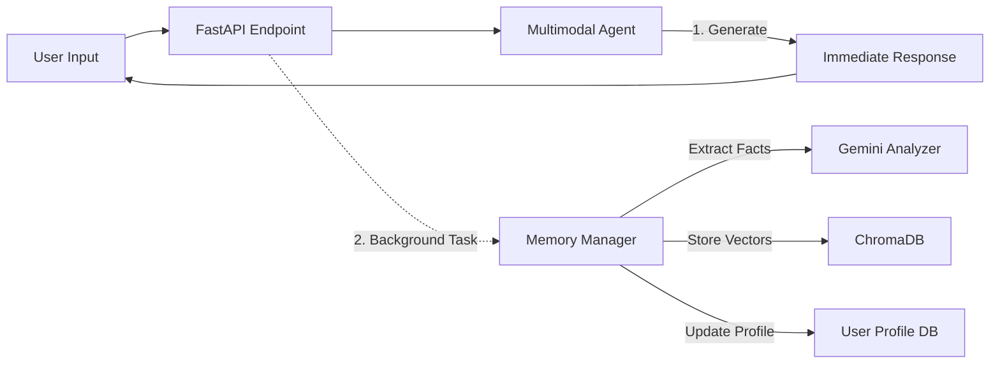
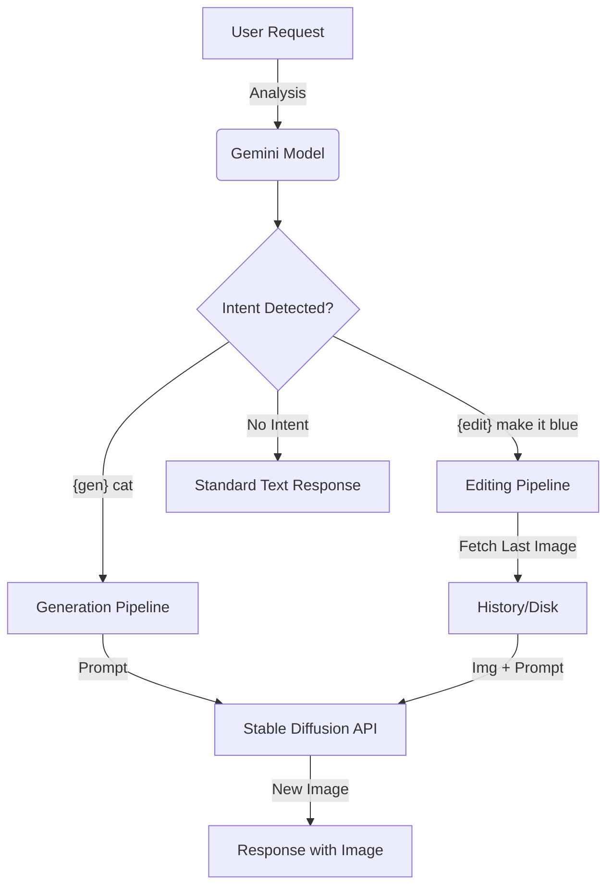

# 🤖 AnanBot: Advanced Multimodal AI Agent

**AnanBot** is a cutting-edge, personality-driven AI agent capable of understanding text and images, remembering past interactions, and generating creative visual content. Built on **Google Gemini**, **ChromaDB**, and **FastAPI**, it bridges the gap between static chatbots and evolving digital companions.

## 🚀 Key Features

### 🧠 **Multimodal Intelligence**
- **See & Understand**: Analyzes images and text seamlessly using Google's Gemini 1.5 Pro/Flash models.
- **Contextual Awareness**: Maintains conversation history to provide relevant and coherent responses.

### 💾 **Infinite Memory (RAG)**
- **Long-term Recall**: Utilizes **ChromaDB** to store and retrieve specific facts about users (e.g., "You remember I like pizza").
- **Adaptive Persona**: Dynamically updates a summary of the user's personality and preferences after every interaction.

### 🎨 **Visual Creativity (Image Workflow)**
- **Image Generation**: Detects `{gen}` intent to create stunning visuals on the fly.
- **Image Editing**: Detects `{edit}` intent to modify existing images based on natural language instructions.
- **Powered by Stable Diffusion**: seamless integration with Automatic1111 WebUI.

### ⚡ **High-Performance Architecture**
- **Asynchronous Core**: Decoupled response generation from memory storage. Users get **instant replies** while the bot creates memories in the background.
- **Robust API**: Fully functional FastAPI backend with `BackgroundTasks` for optimal latency.

### ⚖️ **Karma & Behavior System**
- **Social Credit System**: Tracks user behavior (Karma). High karma leads to helpful responses; low karma triggers hostile/defensive traits.
- **Dynamic Personality**: The bot's attitude shifts based on who it's talking to.

---

## 🛠️ System Architecture

### 1. General Processing Flow (Async Optimized)
AnanBot uses an asynchronous "Fire-and-Forget" memory model to ensure zero latency for the user.



### 2. 🖼️ Picture & Image Workflow
How AnanBot handles visual requests:



---

## 📦 Installation

### Prerequisites
- Python 3.10+
- [Stable Diffusion WebUI](https://github.com/AUTOMATIC1111/stable-diffusion-webui) (for image features)

### Setup
1. **Clone the Repository**
   ```bash
   git clone https://github.com/tanutb/AnanBot.git
   cd AnanBot
   ```

2. **Install Dependencies**
   ```bash
   pip install -r requirements.txt
   ```

3. **Environment Configuration**
   Create a `.env` file in the root directory:
   ```env
   # Core
   GOOGLE_API_KEY=your_gemini_key_here
   DISCORD_TOKEN=your_discord_token_here
   
   # Model Settings
   GEMINI_MODEL_NAME=gemini-1.5-flash
   
   # Image Generation (A1111)
   SD_API_URL=http://127.0.0.1:7860
   ```

---

## 🎮 Usage

### 1. Discord Bot (Production Mode)
Run the bot to interact via Discord channels.
```bash
python discord_bot.py
```

### 2. FastAPI Server (Backend Mode)
Start the API server for external integrations.
```bash
python api.py
```
*Docs available at `http://localhost:8119/docs`*

### 3. Terminal Chat (Debug Mode)
Test the agent directly in your console.
```bash
python terminal_chat.py
```

---

## ⚠️ Notes & Disclaimer
- **Stable Diffusion**: Ensure your WebUI is running with `--api` flag enabled.
- **Memory**: The first run will initialize the ChromaDB vector store.
- **Optimization**: We recently moved memory operations to background tasks. This massively improves perceived latency but means "memories" might take a few seconds to settle after a reply.

---

<p align="center">
    Made with ❤️ and excessive amounts of Caffeine.
</p>