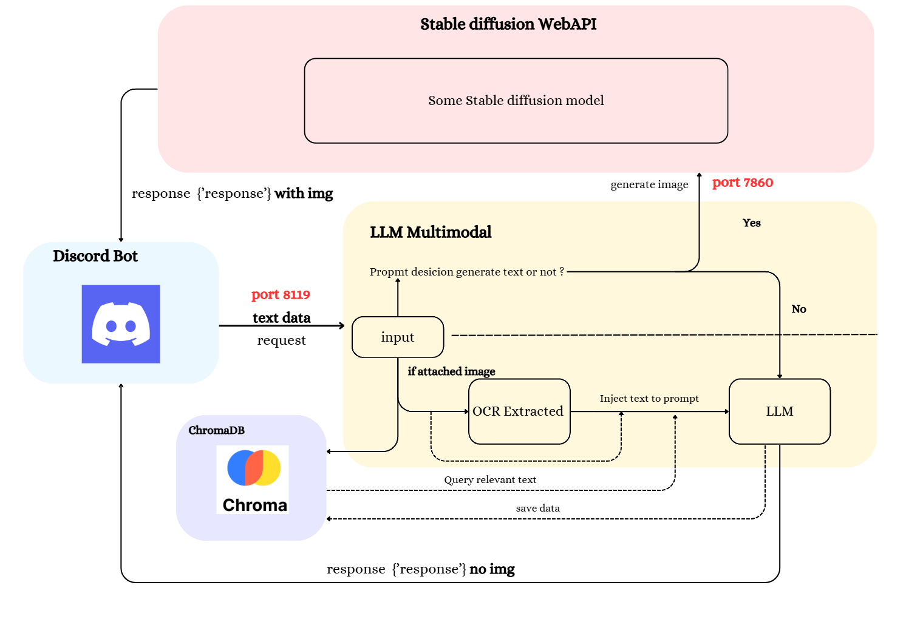

# AnanBot

AnanBot is a flexible bot designed to automate tasks and enhance productivity. It offers a variety of features to assist with text generation, image generation, and image captioning with OCR capabilities.

## Features

- **Text Generation**: Generate high-quality text for various purposes.
- **Image Generation**: Create stunning images based on your input.
- **Image Captioning + OCR**: Extract text from images and generate captions effortlessly.

## Workflow
<p align="center">
    
</p>

## Installation

To install AnanBot, follow these steps:

1. **Clone the Repository**:
    ```sh
    git clone https://github.com/tanutb/AnanBot.git
    ```

2. **Navigate to the Project Directory**:
    ```sh
    cd AnanBot
    ```

3. **Install the Dependencies**:
    ```sh
    pip install -r requirements.txt
    ```

## Usage

AnanBot can be used in different modes based on your requirements. Follow the instructions below to get started:

### Discord Bot

To run the Discord bot:
```python
python discord_bot.py
```

### API
To run the API:
```python
python api.py
```

### Stable Diffusion WebUI Integration

AnanBot integrates with the [Stable Diffusion WebUI](https://github.com/AUTOMATIC1111/stable-diffusion-webui). To use this feature:

1. Ensure the Stable Diffusion WebUI is installed and running.
2. Enable the API port by following the instructions in the [API documentation](https://github.com/AUTOMATIC1111/stable-diffusion-webui/wiki/API).

Once set up, AnanBot can utilize Stable Diffusion for advanced image generation tasks.

---

**Note**: The current performance of the bot is still poor and requires significant optimization for better results